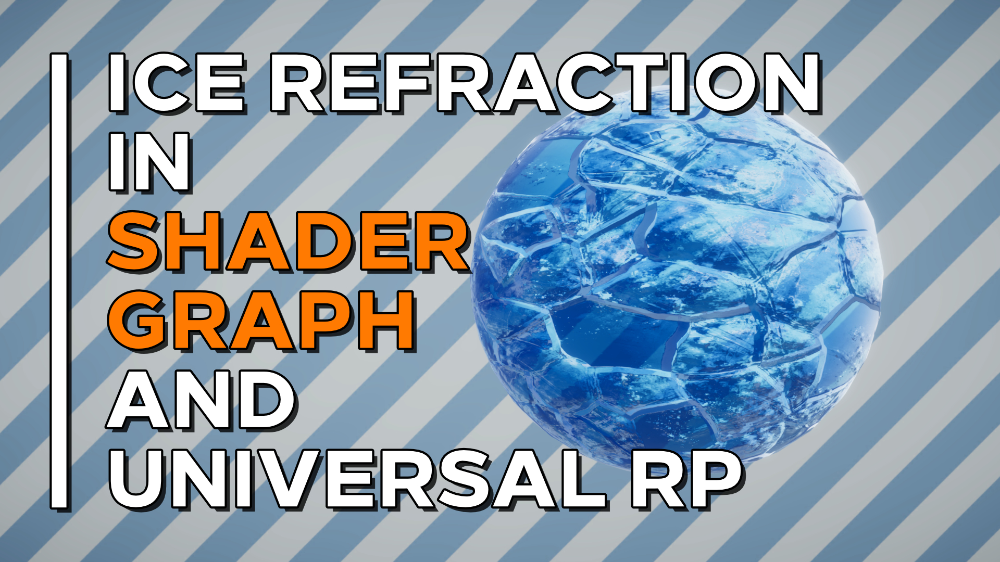

# Ice Refraction in Shader Graph
An ice refraction shader made with Unity Shader Graph and URP.

## Overview

This repository features a shader effect that turns any mesh into textured, refractive ice. The refraction is not physically accurate - it is just a quick and dirty approximation. [A tutorial for the project is available on YouTube](https://youtu.be/inht8WYX-A4)

## Software

This project was created using Unity 2019.4.0f1 and Universal Render Pipeline/Shader Graph 7.3.1.

## Authors

This project and the corresponding tutorial was created by Daniel Ilett. 

## Release

This project was released on December 24th 2020.
